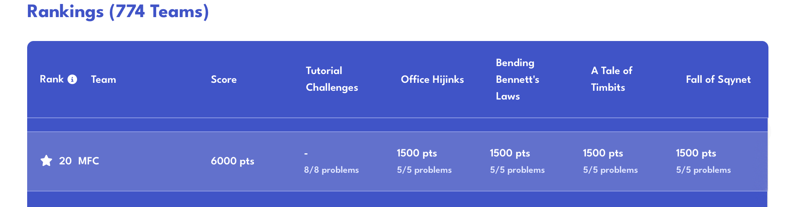

# QHack2023-coding-challenges
Coding challenges and solutions of the [QHack 2023](https://qhack.ai) coding-challenge competition by [Xanadu](https://www.xanadu.ai)

----
## Index

1. [Tutorials](/challenges/tutorials/)
2. [A tale of timbits](/challenges/a_tale_of_timbits)
3. [Bending Bennett's Laws](/challenges/bening_bennetts_laws)
4. [Fall of Sqynet](/challenges/fall_of_sqynet)
5. [Office Hijinks](/challenges/office_hijinks)

----

# Statistics of team:

