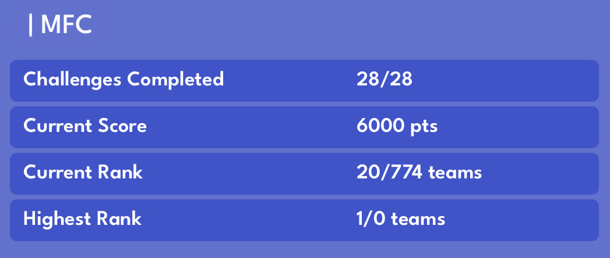

# QHack2023 coding challenges: MFC
 Challenges and solutions by MFC team for the [QHack 2023](https://qhack.ai) coding-challenge competition organized by [Xanadu](https://www.xanadu.ai). 

---
## Contributors:
* [@EmilianoG-byte](https://github.com/EmilianoG-byte)
* [@emilymayhaworth](https://github.com/emilymayhaworth)
* [@fiyoooo](https://github.com/fiyoooo)
* [@LionFrangoulis](https://github.com/LionFrangoulis)
----
## Index

1. [Tutorials](/challenges/tutorials/)
2. [A tale of timbits](/challenges/a_tale_of_timbits)
3. [Bending Bennett's Laws](/challenges/bening_bennetts_laws)
4. [Fall of Sqynet](/challenges/fall_of_sqynet)
5. [Office Hijinks](/challenges/office_hijinks)

----

## Statistics of team:

